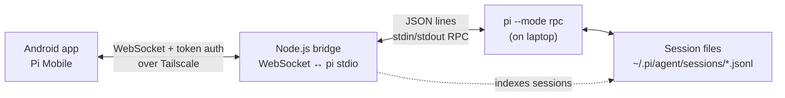

# Pi Mobile

> **Your Pi coding agent, in your pocket.**
> Run and steer coding sessions from Android anywhere over Tailscale.

Pi Mobile is an Android client for the [Pi coding agent](https://github.com/badlogic/pi-mono). It gives you live session control when you’re away from your laptop.

## Demo (WIP)

▶️ **Streamable demo:** https://streamable.com/jngtjp *(WIP)*

## Screenshots

| Chat + tools | Sessions + controls |
|---|---|
|  |  |

## What This Does

Pi runs on your laptop. This app lets you:
- Browse and resume coding sessions from anywhere
- Chat with the agent: prompt, abort, steer, follow-up, compact, rename, copy last response, export, import JSONL sessions
- Discover slash commands from an in-app command palette (`/tree`, `/stats`, `/model`, `/new`, `/name`, `/copy`, `/import`, ...)
- View streaming thinking/tool blocks with collapse/expand controls
- Open a built-in bash dialog (run/abort/history/copy output)
- Inspect session stats, context usage, and pick models from an advanced model picker
- Detect cross-device session drift and run **Sync now** for safe refresh
- Attach images to prompts
- Navigate session tree branches in-place (jump+continue), filter tree views, and fork from selected entries
- Share sessions with authenticated durable opaque links; copy, revoke, and regenerate links without exposing Pi session IDs
- Switch between projects (different working directories)
- Handle extension dialogs/widgets/status updates (confirm/input/select/editor/setStatus/setWidget)

The connection goes over Tailscale, so it works anywhere without port forwarding.

## High-Level Design



The bridge is a small Node.js service that translates WebSocket to pi's stdin/stdout JSON protocol. The app connects to the bridge, not directly to pi. For deeper diagrams, see [docs/architecture.md](docs/architecture.md).

## Documentation

- [Documentation index](docs/README.md)
- [Architecture diagrams (Mermaid)](docs/architecture.md)
- [Architecture Decision Records (ADRs)](docs/adr/README.md)
- [Codebase guide](docs/codebase.md)
- [Custom extensions](docs/extensions.md)
- [Bridge protocol reference](docs/bridge-protocol.md)
- [Testing guide](docs/testing.md)
- [Onboarding and recovery](docs/onboarding.md)

> Note: `docs/ai/` contains planning/progress artifacts used during development. User-facing and maintenance docs live in the top-level `docs/` files above.

## Setup

### 1. Laptop Setup

Install pi if you haven't:
```bash
npm install -g @earendil-works/pi-coding-agent@^0.80.6
pi --version # minimum and tested version: 0.80.6
```

Clone and start the bridge:
```bash
git clone https://github.com/ayagmar/pi-mobile.git
cd pi-mobile/bridge
pnpm install
# create .env and set BRIDGE_AUTH_TOKEN (see Configuration section below)
pnpm start
# In another shell, when BRIDGE_ENABLE_HEALTH_ENDPOINT=true:
curl --fail http://127.0.0.1:8787/health
```

The bridge binds to `127.0.0.1:8787` by default. Set `BRIDGE_HOST` to your laptop Tailscale IP to allow phone access (avoid `0.0.0.0` unless you enforce firewall restrictions). It spawns pi processes on demand per working directory. Set `BRIDGE_STATE_DIR` for owner-only durable share references and optionally `BRIDGE_SHARE_ORIGIN` for a metadata-free self-hosted landing URL; never put tokens or Pi session metadata in links.

### 2. Phone Setup

Install the APK or build from source:
```bash
./gradlew :app:assembleDebug
adb install app/build/outputs/apk/debug/app-debug.apk
```

### 3. Connect

1. With the bridge configured, print a pairing code:

   ```bash
   cd bridge
   pnpm pair
   ```

2. In Pi Mobile, open **Hosts**, tap **Scan QR**, scan the terminal code, review the populated connection, and save it. The QR uses the existing `BRIDGE_AUTH_TOKEN`; keep it private. If automatic Tailscale hostname discovery is unavailable, run `pnpm pair -- --host <reachable-hostname>`.

3. Manual entry remains available:
   - Host: your laptop's Tailscale MagicDNS hostname (`<device>.<tailnet>.ts.net`)
   - Port: `8787` (or whatever the bridge uses)
   - Use TLS: off for local/Tailscale bridge unless you've put TLS in front
   - Token: set this in `bridge/.env` as `BRIDGE_AUTH_TOKEN`; stored tokens are never displayed

4. Use the connection test to distinguish network, authentication, and Pi readiness failures. The app fetches sessions from `~/.pi/agent/sessions/` (or `BRIDGE_SESSION_DIR` if overridden).

5. Tap a session to resume it.

## How It Works

### Sessions

Sessions is a cache-first cockpit across configured hosts. It organizes active, pinned, recent, and explicitly recoverable hidden sessions; searches only privacy-safe labels/previews/model metadata; and never shows full cwd or session-file paths on normal cards. Pins and hidden state persist only local `SessionKey(hostProfileId, sessionId)` values and presentation density. Cross-host refresh is limited to two hosts at a time, and one host failure does not hide another host's cached results.

Text-only quick reply reuses the authenticated session controller and existing control locks. Idle targets resume before dispatch; an active target requires Follow up or Steer; a different active run is never switched away from silently.

### Process Management

The bridge manages one pi process per cwd:
- First connection to a project spawns pi (with internal extensions for tree navigation + mobile workflow commands)
- Process stays alive with idle timeout (`BRIDGE_PROCESS_IDLE_TTL_MS`)
- Short disconnects keep control locks during reconnect grace (`BRIDGE_RECONNECT_GRACE_MS`)
- Reconnecting reuses the existing process
- Crash restart with exponential backoff

### Message Flow

```
User types prompt
    ↓
App sends WebSocket → Bridge
    ↓
Bridge writes to pi stdin (JSON line)
    ↓
pi processes, writes events to stdout
    ↓
Bridge forwards events → App
    ↓
App renders streaming text/tools
```

## Chat UX Highlights

- **Turn-centered conversation**: each prompt groups its assistant activity and final answer into one coherent turn.
- **Quiet thinking disclosures**: reasoning stays collapsed and low-emphasis unless explicitly opened.
- **Compact tool activity**: completed tools collapse into tool-specific summaries; arguments, output, and diffs remain available on demand.
- **Edit diff viewer**: `edit` tool calls show before/after content.
- **Command palette**: insert slash commands quickly from the prompt field menu, including bridge-backed mobile commands.
- **Stable active-run composer**: type inline during a run and deliver the draft as a follow-up or steer without a separate dialog.
- **Reading-position controls**: expanding details pauses live auto-scroll, loading older turns preserves position, and `N new` returns to live activity only when you choose.
- **Image previews**: attached images render from local Android URIs or documented image data embedded in the remote Pi session, with a full-screen preview.
- **Quick copy action**: copy an assistant answer inline or copy the latest response from session details.
- **Bash dialog**: execute shell commands with timeout/truncation handling and history.
- **Session status in chat**: shows the active session name and queued message count from pi state.
- **Session names in session browser**: active named sessions are surfaced more clearly in the Sessions header, rename dialog, and cards.
- **Session details and handoff sheet**: stats, paths, secondary actions, safe handoff summary, latest-response copy, and export.
- **Model picker**: provider-aware searchable model selection.
- **Tree navigator**: inspect branch points, filter views, jump in-place, or fork from chosen entries.
- **Session coherency guard**: routine freshness refreshes stay quiet; explicit other-client conflicts and reload failures remain actionable.
- **Settings controls**: auto-compaction, auto-retry, steer/follow-up delivery modes, theme, and status-strip visibility.

## Troubleshooting

### Can't connect

1. Check Tailscale is running on both devices
2. Verify the bridge is running: `curl http://100.x.x.x:8787/health` (only if `BRIDGE_ENABLE_HEALTH_ENDPOINT=true`)
3. Check the token matches exactly (BRIDGE_AUTH_TOKEN)
4. Prefer the laptop's MagicDNS hostname (`*.ts.net`) over raw IP literals

### Sessions don't appear

1. Check `~/.pi/agent/sessions/` exists on laptop
2. Verify the bridge has read permissions
3. Check bridge logs for errors

### Streaming is slow/choppy

1. Check logcat for `PerfMetrics` - see actual timing numbers
2. Look for `FrameMetrics` jank warnings
3. Verify WiFi/cellular connection is stable
4. Try closer to the laptop (same room)

### App crashes on resume

1. Check logcat for out-of-memory errors
2. Large session histories can cause issues
3. Try compacting the session first: `/compact` in pi, then resume

## Development

### Project Structure

```
app/              - Android app (Compose UI, ViewModels)
core-rpc/         - RPC protocol models and parsing
core-net/         - WebSocket transport and connection management
core-sessions/    - Session caching and repository
bridge/           - Node.js bridge service
benchmark/        - Macrobenchmark / baseline profile scaffolding
```

### Running Tests

Use JDK 25 for builds, a JDK 21 toolchain for stable detekt, Android SDK platform 37.0/build-tools 37.0.0, Node 24 LTS+, and pnpm 10. See [the dependency matrix](docs/dependency-matrix.md).

```bash
# Android tests
./gradlew test

# Bridge tests
cd bridge && pnpm test

# Bridge full checks (lint + typecheck + tests)
cd bridge && pnpm run check

# Complete non-device Android gate
./gradlew clean ktlintCheck detekt test :benchmark:compileBenchmarkKotlin :app:lintDebug :app:assembleDebug :app:assembleRelease
./gradlew :app:compileDebugAndroidTestKotlin
```

### Logs to Watch

```bash
# Performance metrics
adb logcat | grep "PerfMetrics"

# Frame jank during streaming
adb logcat | grep "FrameMetrics"

# General app logs
adb logcat | grep "PiMobile"

# Bridge logs (on laptop)
pnpm start 2>&1 | tee bridge.log
```

## Configuration

### Bridge Environment Variables

Create `bridge/.env`:

```env
BRIDGE_HOST=0.0.0.0                 # Bind host (default: 127.0.0.1)
BRIDGE_PORT=8787                    # Port to listen on
BRIDGE_AUTH_TOKEN=your-secret       # Required authentication token
BRIDGE_PROCESS_IDLE_TTL_MS=300000   # Idle process eviction window (ms)
BRIDGE_RECONNECT_GRACE_MS=30000     # Keep control locks after disconnect (ms)
BRIDGE_SESSION_DIR=/absolute/path/to/.pi/agent/sessions  # Override the session dir used for indexing and spawned pi runtimes
BRIDGE_LOG_LEVEL=info               # fatal,error,warn,info,debug,trace,silent
BRIDGE_ENABLE_HEALTH_ENDPOINT=true  # set false to disable /health endpoint
BRIDGE_WEBSOCKET_MAX_PAYLOAD_BYTES=16777216 # maximum WebSocket message size (16 MiB)
BRIDGE_IMPORT_MAX_BYTES=10485760     # maximum UTF-8 JSONL import size (10 MiB)
BRIDGE_PI_COMMAND=pi                 # Pi executable path/name; probed with --version at startup
BRIDGE_STATE_DIR=/path/to/state           # Durable state for share references
BRIDGE_SHARE_ORIGIN=https://your-domain    # Optional metadata-free landing URL for shared links
```

### App Build Variants

Debug builds include development logging and assertions. The repository-safe release build is unsigned/default and currently keeps minification disabled; see [`docs/release.md`](docs/release.md) before distribution.

## Security Notes

- Token auth is required - don't expose the bridge without it
- Token comparison is hardened in the bridge (constant-time hash compare)
- The bridge binds to localhost by default; explicitly set `BRIDGE_HOST` to your Tailscale IP for remote access
- Avoid `0.0.0.0` unless you intentionally expose the service behind strict firewall/Tailscale policy
- `/health` exposure is explicit via `BRIDGE_ENABLE_HEALTH_ENDPOINT` (disable it for least exposure)
- Android cleartext traffic is scoped to `localhost` and Tailnet MagicDNS hosts (`*.ts.net`)
- All traffic goes over Tailscale's encrypted mesh
- Session data stays on the laptop; the app only displays it

## Limitations

- No offline mode - requires live connection to laptop
- Active history prefers the cursor-based `get_entries` projection and falls back to documented `get_messages` when needed; the UI renders capped windows, not true server-side pages
- Tree display is cached and generation-gated, but navigation still depends on the internal `pi-mobile-tree` extension because Pi 0.80.6 has no navigation RPC command
- Mobile keyboard shortcuts vary by device/IME

## Testing

See [docs/testing.md](docs/testing.md) for emulator setup and testing procedures.

Non-device quick check:
```bash
./gradlew test :app:lintDebug :app:assembleDebug
```

Emulator/device, installation, ADB, benchmark, and manual acceptance commands are operator-owned and require the explicit phrase `debug mode`.

## License

MIT
