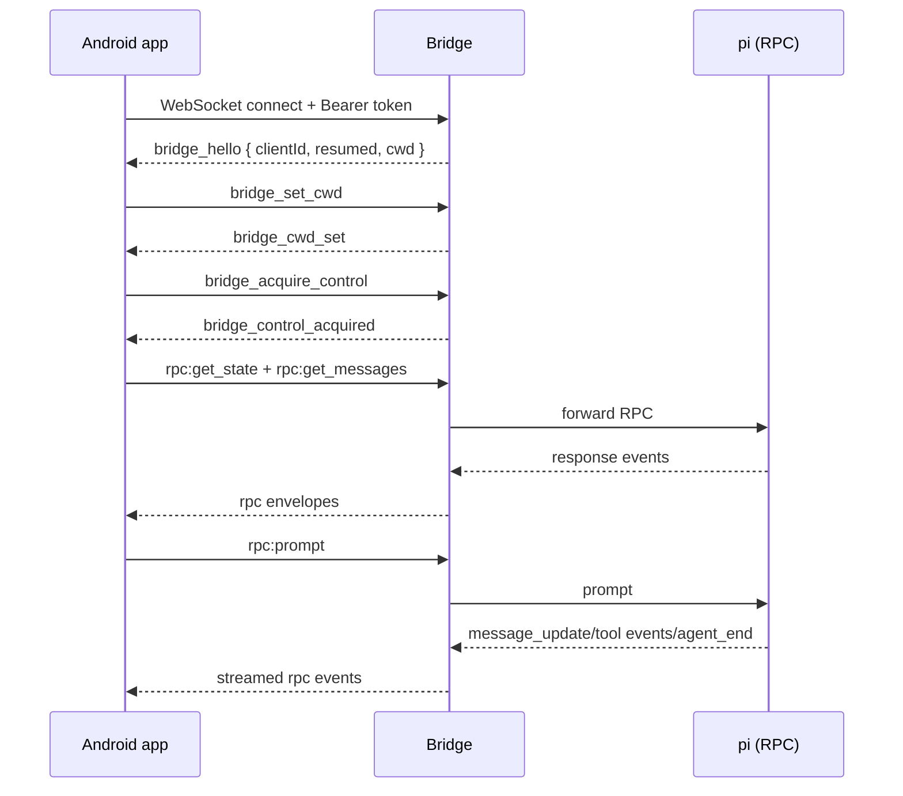
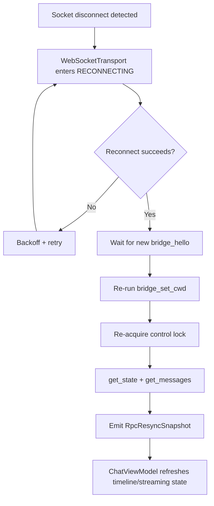
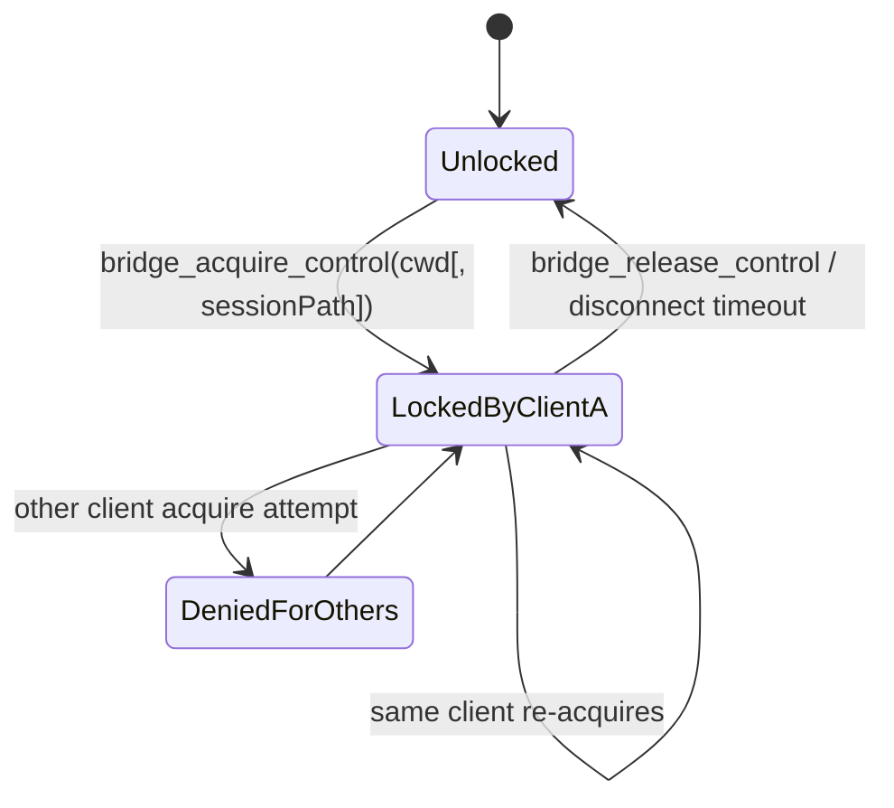

# Pi Mobile Architecture (High-Level)

This document gives a high-level view of how Pi Mobile works across Android, bridge, and pi runtime.

## 1) System Context

```mermaid
flowchart LR
    User[Mobile user]

    subgraph Android[Android app]
      Hosts[Hosts + Tokens]
      Sessions[Sessions screen\ncache + filter]
      Chat[Chat screen + ViewModel]
      Net[PiRpcConnection\nWebSocketTransport]
    end

    subgraph Bridge[Node bridge]
      WS[WebSocket server\n/auth + envelope routing/]
      Locks[Control lock manager\n(cwd + session)]
      PM[Process manager\n(one pi process per cwd)]
      Indexer[Session indexer\nreads JSONL sessions]
      Ext[Internal extensions\npi-mobile-tree\npi-mobile-open-stats]
    end

    subgraph Laptop[Local pi runtime]
      Pi[pi --mode rpc]
      Files[(~/.pi/agent/sessions/*.jsonl)]
    end

    User --> Android
    Hosts --> Sessions
    Sessions --> Net
    Chat --> Net

    Net <-->|ws://.../ws\n{channel,payload}| WS
    WS --> Locks
    WS --> PM
    WS --> Indexer

    PM --> Pi
    Pi --> Ext
    Indexer --> Files
    Pi --> Files
```

## 2) Main Runtime Flow (Resume + Prompt)



## 3) Reconnect + Resync Strategy



## 4) Tree Navigation Bridge Flow

```mermaid
flowchart LR
    A[User selects tree entry] --> B[Android sends bridge_navigate_tree]
    B --> C[Bridge validates cwd + control lock]
    C --> D[Bridge checks get_commands for pi-mobile-tree]
    D --> E[Bridge sends rpc prompt: /pi-mobile-tree <entryId> <statusKey>]
    E --> F[Extension navigates tree + setEditorText + setStatus]
    F --> G[Bridge captures setStatus payload]
    G --> H[Bridge returns bridge_tree_navigation_result]
    H --> I[Android updates tree + editor draft]
```



## 5) Control-Lock Model



## Architectural Notes

- **Bridge is mandatory**: pi RPC is stdio-based; the bridge provides network transport + policy.
- **Per-cwd subprocesses**: isolates project state and keeps tool cwd semantics correct.
- **Control lock before RPC**: prevents concurrent writers to the same cwd/session.
- **Resync after reconnect**: avoids stale UI after transient network failures.
- **Freshness polling in chat**: detects cross-device/session-file drift and prompts user to sync.
- Decision rationale is captured in [ADRs](adr/README.md).
